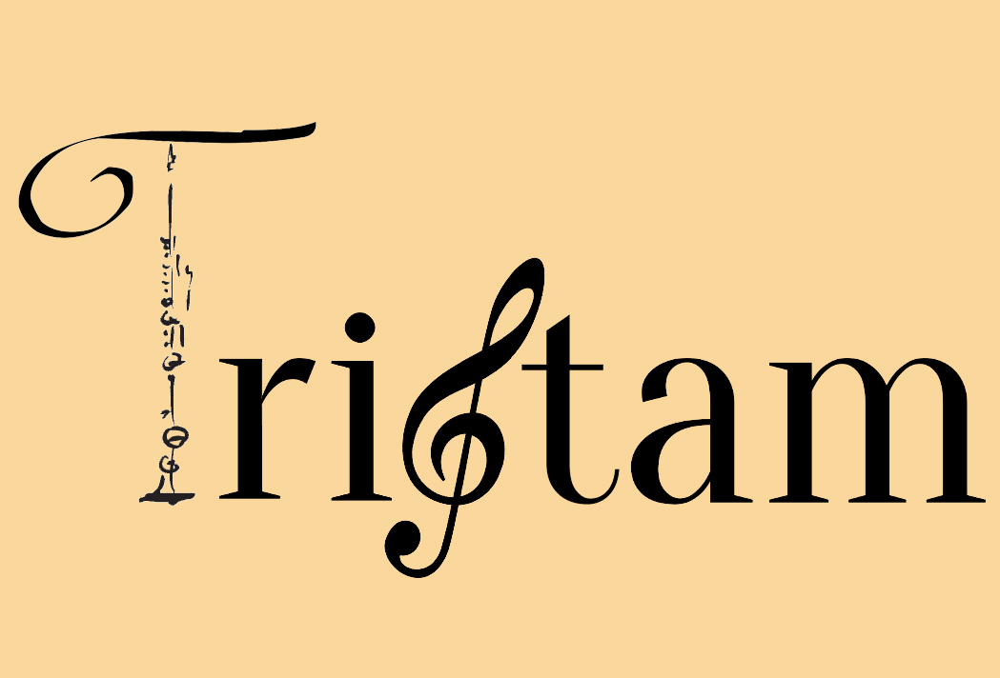

# Tristam
Tristam stands for Training Intelligent Sequencer Tool for Adaptive Music.  
It is a MultiAgent System made for musicians to train their improvisational skills.

# What can Tristam do?
Tristam can use different options to adapt to your playstyle and make a rythm section especifically for it, the rythms are selected from a series of loops that are tied together and it will serve as a dynamic band, making you adapt and adapting to you at the same time. That way it is capable of helping you learn to improvise and improve your skills at a musician especially when playing with a band.

At the moment, Tristam is made for Jazz players and it is made to improvise and play it, but to play another musical style, the only thing you will have to do is replace the loops that are presetn right now with other loops, so it will use them instead.
